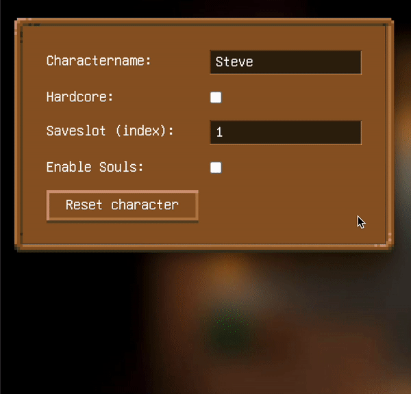

# Core Keeper Save Editor

A simple browser based **Save File Editor** for **Core Keeper**.

## Features

**Core-Keeper-Save-Editor** alows you to comfortably edit various aspects of your character's **save-file** from your browser.

### Editing The Inventory

Search for items in the **item-browser** and simply drag-and-drop them into your inventory.

### Editing Skills & Talents

Set the **level** of each of the 9 skills and **distribute points** to talents in the talent-tree.

### Editing Character Information

Edit character specific information, such as **Name**, **Hardcore-Status**, **Saveslot-Index** and **Obtained Souls**

